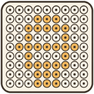

<p align="center">
  
</p>

<h1 align="center">Perlerloom</h1>

<p align="center">
  Turn photos and pixel art into editable bead charts that are ready for real craft work.
</p>

<p align="center">
  <a href="./README.zh-CN.md">简体中文</a>
  ·
  <a href="#what-is-perlerloom">What is Perlerloom?</a>
  ·
  <a href="#why-use-it">Why use it?</a>
  ·
  <a href="#try-it-locally">Try it locally</a>
  ·
  <a href="#development">Development</a>
</p>

<p align="center">
  
  
  
  
</p>

> [!NOTE]
> Perlerloom runs the image-to-chart workflow in your browser. You can import an image, preview it, choose the final bead size, and generate a chart without uploading the image to a server.

> [!TIP]
> For cleaner craft charts, start with a small explicit target size, then tune the target color count before generating.

## What Is Perlerloom?

Perlerloom is a friendly bead-pattern editor for makers who want a practical chart, not just a pixelated preview.

Import a photo, icon, or pixel-art reference, choose how large the finished pattern should be in beads, and let Perlerloom match the result to the Mard bead palette. After generation, keep editing directly on the grid with drawing tools, palette swatches, a legend, and undo/redo history.

The goal is simple: help you move from inspiration to a usable bead chart faster, while keeping the final pattern editable by hand.

## Why Use It?

- Local image conversion keeps your source image on your device.
- Explicit width, height, and scale controls make oversized images manageable.
- Palette matching snaps generated colors to real bead colors instead of arbitrary screen colors.
- The editor stays craft-friendly with a readable grid, legend badges, pencil, bucket, line, hand, and eyedropper tools.
- English and Chinese UI are available from the built-in language switcher.

## Current Progress

- [x] Mard 291-color palette data
- [x] Browser-only image preview and conversion
- [x] Web Worker conversion for heavier images
- [x] Optional dithering and color-count tuning
- [x] Editable bead grid with palette, legend, tools, and history
- [x] English and Chinese interface
- [ ] Cloud save and share
- [x] Print-ready PNG export (grid, bead-code legend, header; from the editor and library)
- [ ] AI-assisted pixel-art conversion

## Try It Locally

```bash
pnpm install
pnpm dev
```

Then open the local web app from the URL printed by Next.js.

Optional cloud settings are only needed for future save/share features:

```bash
NEXT_PUBLIC_SUPABASE_URL=
NEXT_PUBLIC_SUPABASE_ANON_KEY=
```

The free converter and editor work without Supabase credentials.

## Development

This repository is a pnpm workspace. The web app lives in `apps/web`, and shared packages live in `packages/*`.

```bash
pnpm lint
pnpm typecheck
pnpm test
pnpm build
```

## Acknowledgements

Perlerloom is built with Next.js, React, Tailwind CSS, shadcn-compatible UI primitives, Vitest, and the Mard bead palette data used by the converter.